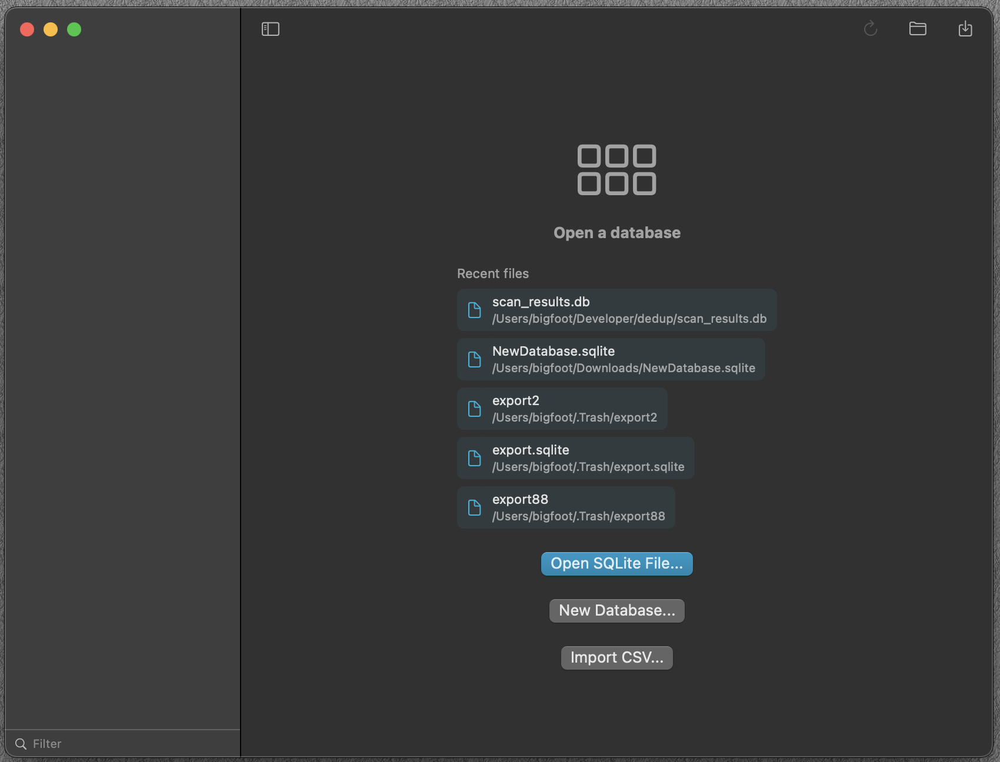
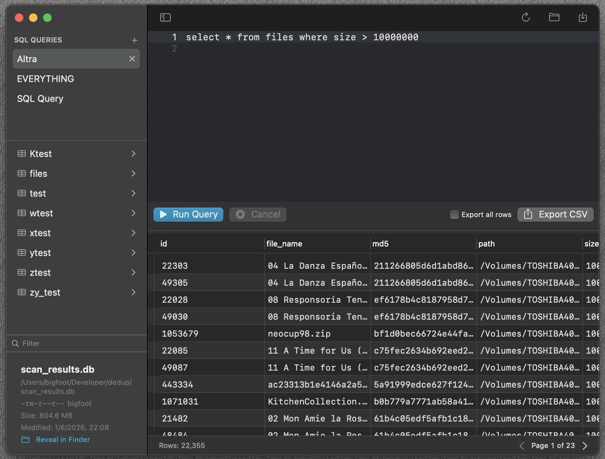

# 🚀 SQLiteo

This is a fork of the native macOS SQLite browser built for normal people, which I use at
 work. Read the original repo for a detailed description.

 How does SQLite fit into the daily workflow? CSV. It's very handy for processing CSV files
 though not limited to that.

 OS13 branch has contains a port for older macOS 13

